# Optimizing LangChain AI Agents with Contextual Engineering

*Sub-agents, Memory Optimization, ScratchPad, Isolation Context*

**By Fareed Khan, Jul 25, 2025**

Context engineering means creating the right setup for an AI before giving it a task. This setup includes:

*   **Instructions** on how the AI should act, like being a helpful budget travel guide
*   Access to **useful info** from databases, documents, or live sources.
*   Remembering **past conversations** to avoid repeats or forgetting.
*   **Tools** the AI can use, such as calculators or search features.
*   Important details about you, like your **preferences** or location.

AI engineers are now shifting from prompt engineering to context engineering because context engineering focuses on providing AI with the right background and tools, making its answers smarter and more useful.

In this blog, we will explore how LangChain and LangGraph two powerful tools for building AI agents, RAG apps, and LLM apps can be used to implement contextual engineering effectively to improve our AI Agents.

All the code is available in this GitHub Repo: [FareedKhan-dev/contextual-engineering-guide](https://github.com/FareedKhan-dev/contextual-engineering-guide)

## Table of Contents

*   What is Context Engineering?
*   Scratchpad with LangGraph
*   Creating StateGraph
*   Memory Writing in LangGraph
*   Scratchpad Selection Approach
*   Memory Selection Ability
*   Advantage of LangGraph BigTool Calling
*   RAG with Contextual Engineering
*   Compression Strategy with knowledgeable Agents
*   Isolating Context using Sub-Agents Architecture
*   Isolation using Sandboxed Environments
*   State Isolation in LangGraph
*   Summarizing Everything

## What is Context Engineering?

LLMs work like a new type of operating system. The LLM acts like the CPU, and its context window works like RAM, serving as its short-term memory. But, like RAM, the context window has limited space for different information.

> Just as an operating system decides what goes into RAM, "context engineering” is about choosing what the LLM should keep in its context.

When building LLM applications, we need to manage different types of context. Context engineering covers these main types:

*   **Instructions**: prompts, examples, memories, and tool descriptions
*   **Knowledge**: facts, stored information, and memories
*   **Tools**: feedback and results from tool calls

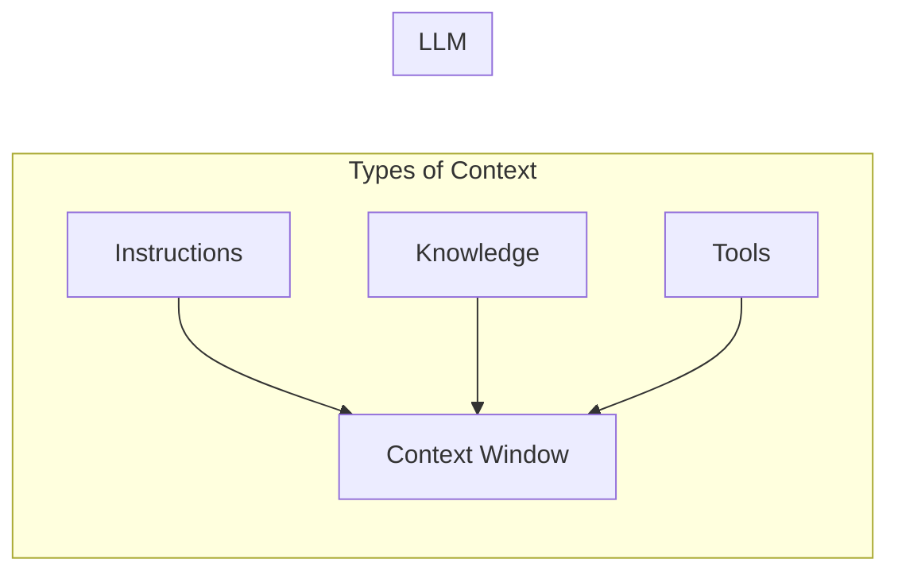

This year, more people are interested in agents because LLMs are better at thinking and using tools. Agents work on long tasks by using LLMs and tools together, choosing the next step based on the tool's feedback.

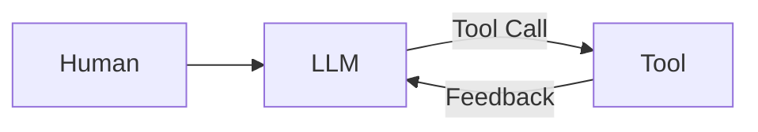

But long tasks and collecting too much feedback from tools use a lot of tokens. This can create problems: the context window can overflow, costs and delays can increase, and the agent might work worse.

Drew Breunig explained how too much context can hurt performance, including:

*   **Context Poisoning**: when a mistake or hallucination gets added to the context
*   **Context Distraction**: when too much context confuses the model
*   **Context Confusion**: when extra, unnecessary details affect the answer
*   **Context Clash**: when parts of the context give conflicting information

Anthropic in their research stressed the need for it:

> Agents often have conversations with hundreds of turns, so managing context carefully is crucial.

So, how are people solving this problem today? Common strategies for agent context engineering can be grouped into four main types:

*   **Write**: creating clear and useful context
*   **Select**: picking only the most relevant information
*   **Compress**: shortening context to save space
*   **Isolate**: keeping different types of context separate

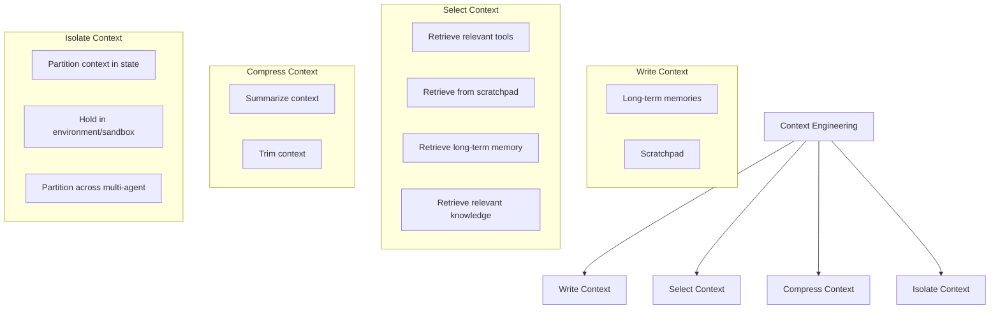

LangGraph is built to support all these strategies. We will go through each of these components one by one in LangGraph and see how they help make our AI agents work better.

## Scratchpad with LangGraph

Just like humans take notes to remember things for later tasks, agents can do the same using a scratchpad. It stores information outside the context window so the agent can access it whenever needed.

A good example is **Anthropic multi-agent researcher**:

> The LeadResearcher plans its approach and saves it to memory, because if the context window goes beyond 200,000 tokens, it gets cut off so saving the plan ensures it isn’t lost.

Scratchpads can be implemented in different ways:

*   As a **tool call** that writes to a file.
*   As a field in a runtime **state object** that persists during the session.

In short, scratchpads help agents keep important notes during a session to complete tasks effectively.

In terms of LangGraph, it supports both **short-term** (thread-scoped) and **long-term** memory.

*   **Short-term memory** uses **checkpointing** to save the agent state during a session. It works like a scratchpad, letting you store information while the agent runs and retrieve it later.

The state object is the main structure passed between graph nodes. You can define its format (usually a Python dictionary). It acts as a shared scratchpad, where each node can read and update specific fields.

> We will only import the modules when we need them, so we can learn step by step in a clear way.

For better and cleaner output, we will use Python `pprint` module for pretty printing and the `Console` module from the `rich` library. Let's import and initialize them first:

```python
# Import necessary libraries
from typing import TypedDict # For defining the state schema with type hints
from rich.console import Console # For pretty-printing output
from rich.pretty import pprint # For pretty-printing Python objects

# Initialize a console for rich, formatted output in the notebook.
console = Console()
```

Next, we will create a `TypedDict` for the state object.

```python
# Define the schema for the graph's state using TypedDict.
# This class acts as a data structure that will be passed between nodes in the
# It ensures that the state has a consistent shape and provides type hints.
class State(TypedDict):
    """
    Defines the structure of the state for our joke generator workflow.

    Attributes:
        topic: The input topic for which a joke will be generated.
        joke: The output field where the generated joke will be stored.
    """
    topic: str
    joke: str
```

This state object will store the topic and the joke that we ask our agent to generate based on the given topic.

## Creating StateGraph

Once we define a state object, we can write context to it using a `StateGraph`.

A `StateGraph` is LangGraph's main tool for building stateful agents or workflows. Think of it as a directed graph:

*   **Nodes** are steps in the workflow. Each node takes the current state as input, updates it, and returns the changes.
*   **Edges** connect nodes, defining how execution flows this can be linear, conditional, or even cyclical.

Next, we will:

1.  Create a **chat model** by choosing from **Anthropic models**.
2.  Use it in a LangGraph workflow.

```python
# Import necessary libraries for environment management, display, and LangGraph
import getpass
import os

from IPython.display import Image, display
from langchain.chat_models import init_chat_model
from langgraph.graph import END, START, StateGraph

# --- Environment and Model Setup ---
# Set the Anthropic API key to authenticate requests
from dotenv import load_dotenv
api_key = os.getenv("ANTHROPIC_API_KEY")
if not api_key:
    raise ValueError("Missing ANTHROPIC_API_KEY in environment")

# Initialize the chat model to be used in the workflow
# We use a specific Claude model with temperature=0 for deterministic outputs
llm = init_chat_model("anthropic:claude-sonnet-4-20250514", temperature=0)
```

We've initialized our Sonnet model. LangChain supports many open-source and closed models through their APIs, so you can use any of them.

Now, we need to create a function that generates a response using this Sonnet model.

```python
# --- Define Workflow Node ---
def generate_joke(state: State) -> dict[str, str]:
    """A node function that generates a joke based on the topic in the current sta

    This function reads the 'topic' from the state, uses the LLM to generate a
    and returns a dictionary to update the 'joke' field in the state.

    Args:
        state: The current state of the graph, which must contain a 'topic'.

    Returns:
        A dictionary with the 'joke' key to update the state.
    """
    # Read the topic from the state
    topic = state["topic"]
    print(f"Generating a joke about: {topic}")

    # Invoke the language model to generate a joke
    msg = llm.invoke(f"Write a short joke about {topic}")

    # Return the generated joke to be written back to the state
    return {"joke": msg.content}
```

This function simply returns a dictionary containing the generated response (the joke).

Now, using the `StateGraph`, we can easily build and compile the graph. Let's do that next.

```python
# --- Build and Compile the Graph ---
# Initialize a new StateGraph with the predefined State schema
workflow = StateGraph(State)

# Add the 'generate_joke' function as a node in the graph
workflow.add_node("generate_joke", generate_joke)

# Define the workflow's execution path:
# The graph starts at the START entrypoint and flows to our 'generate_joke' noc
workflow.add_edge(START, "generate_joke")
# After 'generate_joke' completes, the graph execution ends.
workflow.add_edge("generate_joke", END)

# Compile the workflow into an executable chain
chain = workflow.compile()
```

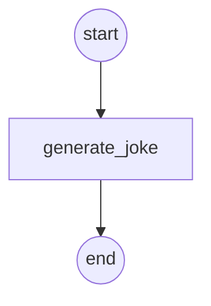

Now we can execute this workflow.

```python
# --- Execute the Workflow ---
# Invoke the compiled graph with an initial state containing the topic.
# The `invoke` method runs the graph from the START node to the END node.
joke_generator_state = chain.invoke({"topic": "cats"})

# --- Display the Final State ---
# Print the final state of the graph after execution.
# This will show both the input 'topic' and the output 'joke' that was written
console.print("\n[bold blue]Joke Generator State:[/bold blue]")
pprint(joke_generator_state)
```

It returns the dictionary which is basically the joke generation state of our agent. This simple example shows how we can write context to state.

## Memory Writing in LangGraph

Scratchpads help agents work within a single session, but sometimes agents need to remember things across multiple sessions.

*   **Reflexion** introduced the idea of agents reflecting after each turn and reusing self-generated hints.
*   **Generative Agents** created long-term memories by summarizing past agent feedback.

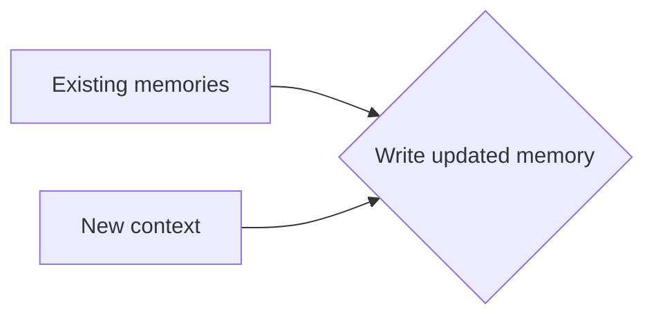

These ideas are now used in products like **ChatGPT, Cursor, and Windsurf**, which automatically create long-term memories from user interactions.

*   **Checkpointing** saves the graph's state at each step in a **thread**. A thread has a unique ID and usually represents one interaction – like a single chat in ChatGPT.
*   **Long-term memory** lets you keep specific context across threads. You can save **individual files** (e.g., a user profile) or **collections** of memories.
*   It uses the `BaseStore` interface, a key-value store. You can use it in memory (as shown here) or with **LangGraph Platform deployments**.

Let's now create an `InMemoryStore` to use across multiple sessions in this notebook.

```python
from langgraph.store.memory import InMemoryStore

# --- Initialize Long-Term Memory Store ---
# Create an instance of InMemoryStore, which provides a simple, non-persistent,
# key-value storage system for use within the current session.
store = InMemoryStore()

# --- Define a Namespace for Organization ---
# A namespace is used to logically group related data within the store.
# Here, we use a tuple to represent a hierarchical namespace,
# which could correspond to a user ID and an application context.
namespace = ("rlm", "joke_generator")

# --- Write Data to the Memory Store ---
# Use the `put` method to save a key-value pair into the specified namespace.
# This operation persists the joke generated in the previous step, making it
# available for retrieval across different sessions or threads.
store.put(
    namespace,  # The namespace to write to
    "last_joke",  # The key for the data entry
    {"joke": joke_generator_state["joke"]},  # The value to be stored
)
```

We'll discuss how to select context from a namespace in the upcoming section. For now, we can use the `search` method to view items within a namespace and confirm that we successfully wrote to it.

```python
# Search the namespace to view all stored items
stored_items = list(store.search(namespace))

# Display the stored items with rich formatting
console.print("\n[bold green]Stored Items in Memory:[/bold green]")
pprint(stored_items)
```

Now, let's embed everything we did into a LangGraph workflow.

We will compile the workflow with two arguments:

*   `checkpointer` saves the graph state at each step in a thread.
*   `store` keeps context across different threads.

```python
from langgraph.checkpoint.memory import InMemorySaver
from langgraph.store.base import BaseStore
from langgraph.store.memory import InMemoryStore

# Initialize storage components
checkpointer = InMemorySaver()  # For thread-level state persistence
memory_store = InMemoryStore()  # For cross-thread memory storage

def generate_joke(state: State, store: BaseStore) -> dict[str, str]:
    """Generate a joke with memory awareness.

    This enhanced version checks for existing jokes in memory
    before generating new ones.

    Args:
        state: Current state containing the topic
        store: Memory store for persistent context

    Returns:
        Dictionary with the generated joke
    """
    # Check if there's an existing joke in memory
    existing_jokes = list(store.search(namespace))
    if existing_jokes:
        existing_joke = existing_jokes[0].value
        print(f"Existing joke: {existing_joke}")
    else:
        print("Existing joke: No existing joke")

    # Generate a new joke based on the topic
    msg = llm.invoke(f"Write a short joke about {state['topic']}")

    # Store the new joke in long-term memory
    store.put(namespace, "last_joke", {"joke": msg.content})

    # Return the joke to be added to state
    return {"joke": msg.content}

# Build the workflow with memory capabilities
workflow = StateGraph(State)

# Add the memory-aware joke generation node
workflow.add_node("generate_joke", generate_joke)

# Connect the workflow components
workflow.add_edge(START, "generate_joke")
workflow.add_edge("generate_joke", END)

# Compile with both checkpointing and memory store
chain = workflow.compile(checkpointer=checkpointer, store=memory_store)
```

Great! Now we can simply execute the updated workflow and test how it works with the memory feature enabled.

```python
# Execute the workflow with thread-based configuration
config = {"configurable": {"thread_id": "1"}}
joke_generator_state = chain.invoke({"topic": "cats"}, config)

# Display the workflow result with rich formatting
console.print("\n[bold cyan]Workflow Result (Thread 1):[/bold cyan]")
pprint(joke_generator_state)
```

Since this is thread 1, there's no existing joke stored in our AI agent's memory which is exactly what we'd expect for a fresh thread.

Because we compiled the workflow with a checkpointer, we can now view the latest state of the graph.

```python
# --- Retrieve and Inspect the Graph State ---
# Use the 'get_state`method to retrieve the latest state snapshot for the
# thread specified in the `config`(in this case, thread "1"). This is
# possible because we compiled the graph with a checkpointer.
latest_state = chain.get_state(config)

# --- Display the State Snapshot ---
# Print the retrieved state to the console. The StateSnapshot includes not only
# the data ('topic', 'joke') but also execution metadata.
console.print("\n[bold magenta]Latest Graph State (Thread 1):[/bold magenta]")
pprint(latest_state)
```

You can see that our state now shows the last conversation we had with the agent in this case, where we asked it to tell a joke about cats.

Let's rerun the workflow with different ID.

```python
# Execute the workflow with a different thread ID
config = {"configurable": {"thread_id": "2"}}
joke_generator_state = chain.invoke({"topic": "cats"}, config)
```

We can see that the joke from the first thread has been successfully saved to memory.

You can learn more about [LangMem](https://langchain-langmem.readthedocs.io/en/latest/) for memory abstractions and the [Ambient Agents Course](https://www.ambient.run/course) for an overview of memory in LangGraph agents.

## Scratchpad Selection Approach

How you select context from a scratchpad depends on its implementation:

*   If it's a **tool**, the agent can read it directly by making a tool call.
*   If it's part of the agent's runtime **state**, you (the developer) decide which parts of the state to share with the agent at each step. This gives you fine-grained control over what context is exposed.

In previous step, we learned how to write to the LangGraph state object. Now, we'll learn how to select context from the state and pass it to an LLM call in a downstream node.

This selective approach lets you control exactly what context the LLM sees during execution.

```python
def generate_joke(state: State) -> dict[str, str]:
    """Generate an initial joke about the topic.

    Args:
        state: Current state containing the topic

    Returns:
        Dictionary with the generated joke
    """
    msg = llm.invoke(f"Write a short joke about {state['topic']}")
    return {"joke": msg.content}

def improve_joke(state: State) -> dict[str, str]:
    """Improve an existing joke by adding wordplay.

    This demonstrates selecting context from state - we read the existing
    joke from state and use it to generate an improved version.

    Args:
        state: Current state containing the original joke

    Returns:
        Dictionary with the improved joke
    """
    print(f"Initial joke: {state['joke']}")

    # Select the joke from state to present it to the LLM
    msg = llm.invoke(f"Make this joke funnier by adding wordplay: {state['joke']}")
    return {"improved_joke": msg.content}
```

To make things a bit more complex, we're now adding two workflows to our agent:

1.  **Generate Joke** same as before.
2.  **Improve Joke** takes the generated joke and makes it better.

This setup will help us understand how scratchpad selection works in LangGraph. Let's now compile this workflow the same way we did earlier and check how our graph looks.

```python
# Build the workflow with two sequential nodes
workflow = StateGraph(State)

# Add both joke generation nodes
workflow.add_node("generate_joke", generate_joke)
workflow.add_node("improve_joke", improve_joke)

# Connect nodes in sequence
workflow.add_edge(START, "generate_joke")
workflow.add_edge("generate_joke", "improve_joke")
workflow.add_edge("improve_joke", END)

# Compile the workflow
chain = workflow.compile()

# Display the workflow visualization
display(Image(chain.get_graph().draw_mermaid_png()))
```

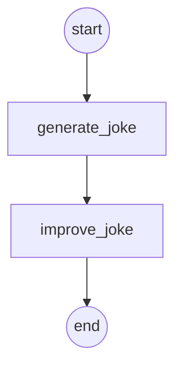

When we execute this workflow, this is what we get.

```python
# Execute the workflow to see context selection in action
joke_generator_state = chain.invoke({"topic": "cats"})

# Display the final state with rich formatting
console.print("\n[bold blue]Final Workflow State:[/bold blue]")
pprint(joke_generator_state)
```

Now that we have executed our workflow, we can move on to using it in our memory selection step.

## Memory Selection Ability

If agents can save memories, they also need to select relevant memories for the task at hand. This is useful for:

*   **Episodic memories** few-shot examples showing desired behavior.
*   **Procedural memories** instructions to guide behavior.
*   **Semantic memories** facts or relationships that provide task-relevant context.

Some agents use narrow, predefined files to store memories:

*   Claude Code uses `CLAUDE.md`.
*   Cursor and Windsurf use “rules” files for instructions or examples.

But when storing a large collection of facts (semantic memories), selection gets harder.

*   **ChatGPT** sometimes retrieves irrelevant memories, as shown by Simon Willison when ChatGPT wrongly fetched his location and injected it into an image making the context feel like it “no longer belonged to him".
*   To improve selection, **embeddings** or **knowledge graphs** are used for indexing.

In our previous section, we wrote to the `InMemoryStore` in graph nodes. Now, we can select context from it using the `get` method to pull relevant state into our workflow.

```python
from langgraph.store.memory import InMemoryStore

# Initialize the memory store
store = InMemoryStore()

# Define namespace for organizing memories
namespace = ("rlm", "joke_generator")

# Store the generated joke in memory
store.put(
    namespace,  # namespace for organization
    "last_joke",  # key identifier
    {"joke": joke_generator_state["joke"]}
)

# Select (retrieve) the joke from memory
retrieved_joke = store.get(namespace, "last_joke").value

# Display the retrieved context
console.print("\n[bold green]Retrieved Context from Memory:[/bold green]")
pprint(retrieved_joke)
```

It successfully retrieves the correct joke from memory.

Now, we need to write a proper `generate_joke` function that can:

1.  Take the current state (for the scratchpad context).
2.  Use memory (to fetch past jokes if we're performing a joke improvement task).

Let's code that next.

```python
# Initialize storage components
checkpointer = InMemorySaver()
memory_store = InMemoryStore()

def generate_joke(state: State, store: BaseStore) -> dict[str, str]:
    """Generate a joke with memory-aware context selection.

    This function demonstrates selecting context from memory before
    generating new content, ensuring consistency and avoiding duplication.

    Args:
        state: Current state containing the topic
        store: Memory store for persistent context

    Returns:
        Dictionary with the generated joke
    """
    # Select prior joke from memory if it exists
    prior_joke = store.get(namespace, "last_joke")
    if prior_joke:
        prior_joke_text = prior_joke.value["joke"]
        print(f"Prior joke: {prior_joke_text}")
    else:
        print("Prior joke: None!")

    # Generate a new joke that differs from the prior one
    prompt = (
        f"Write a short joke about {state['topic']}, "
        f"but make it different from any prior joke you've written: {prior_joke}"
    )
    msg = llm.invoke(prompt)

    # Store the new joke in memory for future context selection
    store.put(namespace, "last_joke", {"joke": msg.content})

    return {"joke": msg.content}
```

We can now simply execute this memory-aware workflow the same way we did earlier.

```python
# Build the memory-aware workflow
workflow = StateGraph(State)

workflow.add_node("generate_joke", generate_joke)

# Connect the workflow
workflow.add_edge(START, "generate_joke")
workflow.add_edge("generate_joke", END)

# Compile with both checkpointing and memory store
chain = workflow.compile(checkpointer=checkpointer, store=memory_store)

# Execute the workflow with the first thread
config = {"configurable": {"thread_id": "1"}}
joke_generator_state = chain.invoke({"topic": "cats"}, config)
```

No prior joke is detected, We can now print the latest state structure.

```python
# Get the latest state of the graph
latest_state = chain.get_state(config)

console.print("\n[bold magenta]Latest Graph State:[/bold magenta]")
pprint(latest_state)
```

We fetch the previous joke from memory and pass it to the LLM to improve it.

```python
# Execute the workflow with a second thread to demonstrate memory persistence
config = {"configurable": {"thread_id": "2"}}
joke_generator_state = chain.invoke({"topic": "cats"}, config)
```

It has successfully fetched the correct joke from memory and improved it as expected.

## Advantage of LangGraph BigTool Calling

Agents use tools, but giving them too many tools can cause confusion, especially when tool descriptions overlap. This makes it harder for the model to choose the right tool.

A solution is to use RAG (Retrieval-Augmented Generation) on tool descriptions to fetch only the most relevant tools based on semantic similarity a method Drew Breunig calls **tool loadout**.

> According to recent research, this improves tool selection accuracy by up to 3x.

For tool selection, the LangGraph Bigtool library is ideal. It applies semantic similarity search over tool descriptions to select the most relevant ones for the task. It uses LangGraph's long-term memory store, allowing agents to search and retrieve the right tools for a given problem.

Let's understand `langgraph-bigtool` by using an agent with all functions from Python's built-in `math` library.

```python
import math

# Collect functions from `math` built-in
all_tools = []
for function_name in dir(math):
    function = getattr(math, function_name)
    if not isinstance(
        function,
        types.BuiltinFunctionType
    ):
        continue
    # This is an idiosyncrasy of the `math` library
    if tool := convert_positional_only_function_to_tool(
        function
    ):
        all_tools.append(tool)
```

We first append all functions from Python's `math` module into a list. Next, we need to convert these tool descriptions into vector embeddings so the agent can perform semantic similarity searches.

For this, we will use an embedding model in our case, the OpenAI text-embedding model.

```python
# Create registry of tools. This is a dict mapping
# identifiers to tool instances.
tool_registry = {
    str(uuid.uuid4()): tool
    for tool in all_tools
}

# Index tool names and descriptions in the LangGraph
# Store. Here we use a simple in-memory store.
embeddings = init_embeddings("openai:text-embedding-3-small")

store = InMemoryStore(
    index={
        "embed": embeddings,
        "dims": 1536,
        "fields": ["description"],
    }
)
for tool_id, tool in tool_registry.items():
    store.put(
        ("tools",),
        tool_id,
        {
            "description": f"{tool.name}: {tool.description}",
        },
    )
```

Each function is assigned a unique ID, and we structure these functions into a proper standardized format. This structured format ensures that the functions can be easily converted into embeddings for semantic search.

Let's now visualize the agent to see how it looks with all the math functions embedded and ready for semantic search!

```python
# Initialize agent
builder = create_agent(llm, tool_registry)
agent = builder.compile(store=store)
agent
```

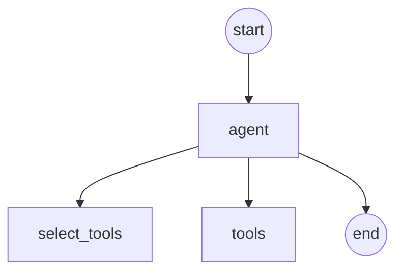

We can now invoke our agent with a simple query and observe how our tool-calling agent selects and uses the most relevant math functions to answer the question.

```python
# Import a utility function to format and display messages
from utils import format_messages

# Define the query for the agent.
# This query asks the agent to use one of its math tools to find the arc cosine
query = "Use available tools to calculate arc cosine of 0.5."

# Invoke the agent with the query. The agent will search its tools,
# select the 'acos' tool based on the query's semantics, and execute it.
result = agent.invoke({"messages": query})

# Format and display the final messages from the agent's execution.
format_messages(result['messages'])
```

You can see how efficiently our ai agent is calling the correct tool. You can learn more about:

*   [Toolshed](https://arxiv.org/abs/2405.06554) introduces Toolshed Knowledge Bases and Advanced RAG-Tool Fusion for better tool selection in AI agents.
*   [Graph RAG-Tool Fusion](https://arxiv.org/abs/2404.16209) combines vector retrieval with graph traversal to capture tool dependencies.
*   [LLM-Tool-Survey](https://arxiv.org/abs/2305.16504) a comprehensive survey of tool learning with LLMs.
*   [ToolRet](https://arxiv.org/abs/2403.02622) a benchmark for evaluating and improving tool retrieval in LLMs.

## RAG with Contextual Engineering

RAG (Retrieval-Augmented Generation) is a vast topic, and code agents are some of the best examples of agentic RAG in production.

In practice, RAG is often the central challenge of context engineering. As Varun from Windsurf points out:

> Indexing ≠ context retrieval. Embedding search with AST-based chunking works, but fails as codebases grow. We need hybrid retrieval: grep/file search, knowledge-graph linking, and relevance-based re-ranking.

LangGraph provides [tutorials and videos](https://www.youtube.com/watch?v=JeyDrn1dSUQ) to help integrate RAG into agents. Typically, you build a retrieval tool that can use any combination of RAG techniques mentioned above.

To demonstrate, we'll fetch documents for our RAG system using three of the most recent pages from Lilian Weng's excellent blog.

We will start by pulling page content with the `WebBaseLoader` utility.

```python
# Import the WebBaseLoader to fetch documents from URLs
from langchain_community.document_loaders import WebBaseLoader

# Define the list of URLs for Lilian Weng's blog posts
urls = [
    "https://lilianweng.github.io/posts/2025-05-01-thinking/",
    "https://lilianweng.github.io/posts/2024-11-28-reward-hacking/",
    "https://lilianweng.github.io/posts/2024-07-07-hallucination/",
    "https://lilianweng.github.io/posts/2024-04-12-diffusion-video/",
]

# Load the documents from the specified URLs using a list comprehension.
# This creates a WebBaseLoader for each URL and calls its load() method.
docs = [WebBaseLoader(url).load() for url in urls]
```

There are different ways to chunk data for RAG, and proper chunking is crucial for effective retrieval.

Here, we'll split the fetched documents into smaller chunks before indexing them into our vectorstore. We'll use a simple, direct approach such as recursive chunking with overlapping segments to preserve context across chunks while keeping them manageable for embedding and retrieval.

```python
# Import the text splitter for chunking documents
from langchain_text_splitters import RecursiveCharacterTextSplitter

# Flatten the list of documents. WebBaseLoader returns a list of documents for
# so we have a list of lists. This comprehension combines them into a single li
docs_list = [item for sublist in docs for item in sublist]

# Initialize the text splitter. This will split the documents into smaller chur
# of a specified size, with some overlap between chunks to maintain context.
text_splitter = RecursiveCharacterTextSplitter.from_tiktoken_encoder(
    chunk_size=2000, chunk_overlap=50
)

# Split the documents into chunks.
doc_splits = text_splitter.split_documents(docs_list)
```

Now that we have our split documents, we can index them into a vector store that we'll use for semantic search.

```python
# Import the necessary class for creating an in-memory vector store
from langchain_core.vectorstores import InMemoryVectorStore

# Create an in-memory vector store from the document splits.
# This uses the 'doc_splits' created in the previous cell and the 'embeddings'
# initialized earlier to create vector representations of the text chunks.
vectorstore = InMemoryVectorStore.from_documents(
    documents=doc_splits, embedding=embeddings
)

# Create a retriever from the vector store.
# The retriever provides an interface to search for relevant documents
# based on a query.
retriever = vectorstore.as_retriever()
```

We have to create a retriever tool that we can use in our agent.

```python
# Import the function to create a retriever tool
from langchain.tools.retriever import create_retriever_tool

# Create a retriever tool from the vector store retriever.
# This tool allows the agent to search for and retrieve relevant
# documents from the blog posts based on a query.
retriever_tool = create_retriever_tool(
    retriever,
    "retrieve_blog_posts",
    "Search and return information about Lilian Weng blog posts.",
)
```

Now, we can implement an agent that can select context from the tool.
For RAG based solutions, we need to create a clear system prompt to guide our agent's behavior. This prompt acts as its core instruction set.

```python
from langgraph.graph import MessagesState
from langchain_core.messages import SystemMessage, ToolMessage
from typing_extensions import Literal

rag_prompt = """You are a helpful assistant tasked with retrieving information
Clarify the scope of research with the user before using your retrieval tool to
proceed until you have sufficient context to answer the user's research request"""
```

Next, we define the nodes of our graph. We'll need two main nodes:

1.  `llm_call` This is the brain of our agent. It takes the current conversation history (user query + previous tool outputs). It then decides the next step, call a tool or generate a final answer.
2.  `tool_node` This is the action part of our agent. It executes the tool call requested by `llm_call`. It returns the tool's result back to the agent.

```python
# --- Define Agent Nodes ---
def llm_call(state: MessagesState):
    """LLM decides whether to call a tool or generate a final answer."""
    # Add the system prompt to the current message state
    messages_with_prompt = [SystemMessage(content=rag_prompt)] + state["messages"]
    # Invoke the LLM with the augmented message list
    response = llm_with_tools.invoke(messages_with_prompt)
    # Return the LLM's response to be added to the state
    return {"messages": [response]}

def tool_node(state: dict):
    """Performs the tool call and returns the observation."""
    # Get the last message, which should contain the tool calls
    last_message = state["messages"][-1]
    # Execute each tool call and collect the results
    result = []
    for tool_call in last_message.tool_calls:
        tool = tools_by_name[tool_call["name"]]
        observation = tool.invoke(tool_call["args"])
        result.append(ToolMessage(content=str(observation), tool_call_id=tool_call['id']))
    # Return the tool's output as a message
    return {"messages": result}
```

We need a way to control the agent's flow deciding whether it should call a tool or if it's finished.

To handle this, we will create a conditional edge function called `should_continue`.

*   This function checks if the last message from the LLM contains a tool call.
*   If it does, the graph routes to the `tool_node`.
*   If not, the execution ends.

```python
# --- Define Conditional Edge ---
def should_continue(state: MessagesState) -> Literal["Action", END]:
    """Decides the next step based on whether the LLM made a tool call."""
    last_message = state["messages"][-1]
    # If the LLM made a tool call, route to the tool_node
    if last_message.tool_calls:
        return "Action"
    # Otherwise, end the workflow
    return END
```

We can now simply build the workflow and compile the graph.

```python
# Build workflow
agent_builder = StateGraph(MessagesState)

# Add nodes
agent_builder.add_node("llm_call", llm_call)
agent_builder.add_node("environment", tool_node)

# Add edges to connect nodes
agent_builder.add_edge(START, "llm_call")
agent_builder.add_conditional_edges(
    "llm_call",
    should_continue,
    {
        # Name returned by should_continue : Name of next node to visit
        "Action": "environment",
        END: END,
    },
)
agent_builder.add_edge("environment", "llm_call")

# Compile the agent
agent = agent_builder.compile()
```

The graph shows a clear cycle:

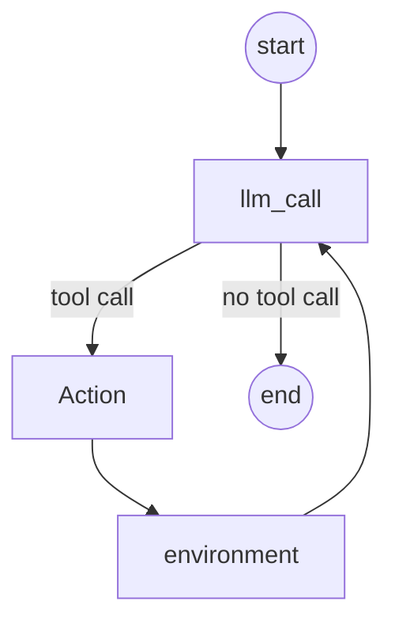

1.  the agent starts, calls the LLM.
2.  based on the LLM's decision, it either performs an action (calls our retriever tool) and loops back, or it finishes and provides the answer

Let's test our RAG agent. We'll ask it a specific question about “reward hacking" that can only be answered by retrieving information from the blog posts we indexed.

```python
# Define the user's query
query = "What are the types of reward hacking discussed in the blogs?"

# Invoke the agent with the query
result = agent.invoke({"messages": [("user", query)]})

# --- Display the Final Messages ---
# Format and print the conversation flow
format_messages(result['messages'])
```

As you can see, the agent correctly identified that it needed to use its retrieval tool. It then successfully retrieved the relevant context from the blog posts and used that information to provide a detailed and accurate answer.

This is a perfect example of how contextual engineering through RAG can create powerful, knowledgeable agents.

## Compression Strategy with knowledgeable Agents

Agent interactions can span hundreds of turns and involve token-heavy tool calls. Summarization is a common way to manage this.

For example:

*   **Claude Code** uses “auto-compact" when the context window exceeds 95%, summarizing the entire user-agent interaction history.
*   **Summarization** can compress an agent trajectory using strategies like recursive or hierarchical summarization.

You can also add summarization at specific points:

*   After token-heavy tool calls (e.g., search tools) [example here](https://langchain-langgraph.readthedocs.io/en/latest/how-tos/memory/1-long-term-memory/).
*   At agent-agent boundaries for knowledge transfer Cognition does this in Devin using a fine-tuned model.

You can learn more about [LangMem Summarization](https://langchain-langmem.readthedocs.io/en/latest/) for memory abstractions and the [Ambient Agents Course](https://www.ambient.run/course) for an overview of memory in LangGraph agents.

LangGraph is a low-level orchestration framework, giving you full control over:

*   Designing your agent as a set of **nodes**.
*   Explicitly defining logic within each node.
*   Passing a shared state object between nodes.

This makes it easy to compress context in different ways. For instance, you can:

*   Use a message list as the agent state.
*   Summarize it with built-in utilities.

We will be using the same RAG based tool calling agent we coded earlier and add summarization of its conversation history.

```python
class State(MessagesState):
    """Extended state that includes a summary field for context compression."""
    summary: str
```

Next, we'll define a dedicated prompt for summarization and keep our RAG prompt from before.

```python
# Define the summarization prompt
summarization_prompt = """Summarize the full chat history and all tool feedback
give an overview of what the user asked about and what the agent did."""
```

Now, we'll create a `summary_node`.

*   This node will be triggered at the end of the agent's work to generate a concise summary of the entire interaction.
*   The `llm_call` and `tool_node` remain unchanged.

```python
def summary_node(state: MessagesState) -> dict:
    """
    Generate a summary of the conversation and tool interactions.

    Args:
        state: The current state of the graph, containing the message history.

    Returns:
        A dictionary with the key "summary" and the generated summary string
        as the value, which updates the state.
    """
    # Prepend the summarization system prompt to the message history
    messages = [SystemMessage(content=summarization_prompt)] + state["messages"]
    # Invoke the language model to generate the summary
    result = llm.invoke(messages)
    # Return the summary to be stored in the 'summary' field of the state
    return {"summary": result.content}
```

Our conditional edge `should_continue` now needs to decide whether to call a tool or move forward to the new `summary_node`.

```python
def should_continue(state: MessagesState) -> Literal["Action", "summary_node"]:
    """Determine next step based on whether LLM made tool calls."""
    last_message = state["messages"][-1]
    # If LLM made tool calls, route to the tool_node
    if last_message.tool_calls:
        return "Action"
    # Otherwise, proceed to summarization
    return "summary_node"
```

Let's build the graph with this new summarization step at the end.

```python
# Build the RAG agent workflow
agent_builder = StateGraph(State)

# Add nodes to the workflow
agent_builder.add_node("llm_call", llm_call)
agent_builder.add_node("Action", tool_node)
agent_builder.add_node("summary_node", summary_node)

# Define the workflow edges
agent_builder.add_edge(START, "llm_call")
agent_builder.add_conditional_edges(
    "llm_call",
    should_continue,
    {
        "Action": "Action",
        "summary_node": "summary_node",
    },
)
agent_builder.add_edge("Action", "llm_call")
agent_builder.add_edge("summary_node", END)

# Compile the agent
agent = agent_builder.compile()
```

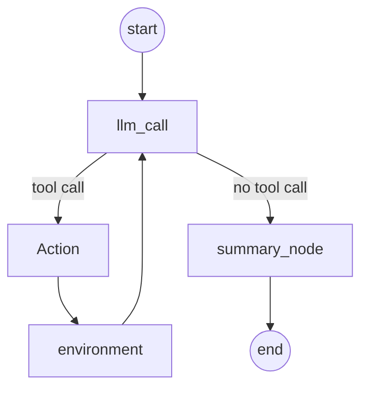

Now, let's run it with a query that will require fetching a lot of context.

```python
query = "Why does RL improve LLM reasoning according to the blogs?"
result = agent.invoke({"messages": [("user", query)]})

# Print the final message to the user
format_message(result['messages'][-1])

# Print the generated summary
Markdown(result["summary"])
```

Nice, but it uses **115k tokens**! You can see the full trace [here](https://smith.langchain.com/public/c1a2c21c-4e9f-4e5b-9b8f-2d3b8c1e3e3d/r). This is a common challenge with agents that have token-heavy tool calls.

A more efficient approach is to compress the context *before* it enters the agent's main scratchpad. Let's update the RAG agent to summarize the tool call output on the fly.

First, a new prompt for this specific task:

```python
tool_summarization_prompt = """You will be provided a doc from a RAG system.
Summarize the docs, ensuring to retain all relevant / essential information.
Your goal is simply to reduce the size of the doc (tokens) to a more manageable"""
```

Next, we'll modify our `tool_node` to include this summarization step.

```python
def tool_node_with_summarization(state: dict):
    """Performs the tool call and then summarizes the output."""
    result = []
    for tool_call in state["messages"][-1].tool_calls:
        tool = tools_by_name[tool_call["name"]]
        observation = tool.invoke(tool_call["args"])
        # Summarize the doc
        summary_msg = llm.invoke([
            SystemMessage(content=tool_summarization_prompt),
            ("user", str(observation))
        ])
        result.append(ToolMessage(content=summary_msg.content, tool_call_id=tool_call['id']))
    return {"messages": result}
```

Now, our `should_continue` edge can be simplified since we don't need the final `summary_node` anymore.

```python
def should_continue(state: MessagesState) -> Literal["Action", END]:
    """Decide if we should continue the loop or stop."""
    if state["messages"][-1].tool_calls:
        return "Action"
    return END
```

Let's build and compile this more efficient agent.

```python
# Build workflow
agent_builder = StateGraph(MessagesState)

# Add nodes
agent_builder.add_node("llm_call", llm_call)
agent_builder.add_node("Action", tool_node_with_summarization)

# Add edges to connect nodes
agent_builder.add_edge(START, "llm_call")
agent_builder.add_conditional_edges(
    "llm_call",
    should_continue,
    {
        "Action": "Action",
        END: END,
    },
)
agent_builder.add_edge("Action", "llm_call")

# Compile the agent
agent = agent_builder.compile()
```

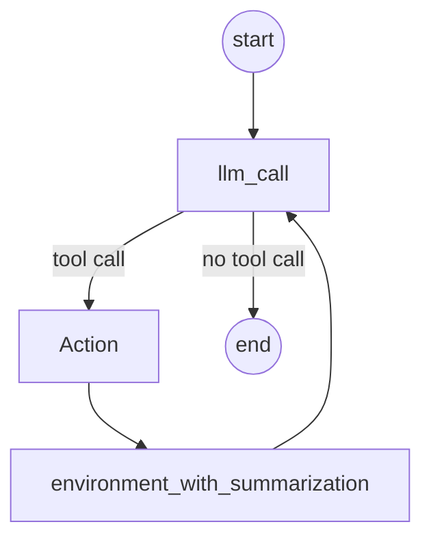

Let's run the same query and see the difference.

```python
query = "Why does RL improve LLM reasoning according to the blogs?"
result = agent.invoke({"messages": [("user", query)]})
format_messages(result['messages'])
```

This time, the agent only used **60k tokens** See the trace [here](https://smith.langchain.com/public/3e3b8c1e-4e9f-4e5b-9b8f-2d3b8c1e3e3d/r).

This simple change cut our token usage nearly in half, making the agent far more efficient and cost-effective.

You can learn more about:

*   [Heuristic Compression and Message Trimming](https://langchain-langgraph.readthedocs.io/en/latest/how-tos/compression/)
    managing token limits by trimming messages to prevent context overflow.
*   [SummarizationNode as Pre-Model Hook](https://langchain-langgraph.readthedocs.io/en/latest/how-tos/compression/#summarizationnode-as-pre-model-hook)
    summarizing conversation history to control token usage in ReAct agents.
*   [LangMem Summarization](https://langchain-langmem.readthedocs.io/en/latest/)
    strategies for long context management with message summarization and running summaries.

## Isolating Context using Sub-Agents Architecture

A common way to isolate context is by splitting it across sub-agents. OpenAI Swarm library was designed for this “separation of concerns” where each agent manages a specific sub-task with its own tools, instructions, and context window.

Anthropic's multi-agent researcher showed that multiple agents with isolated contexts outperformed a single agent by 90.2%, as each sub-agent focuses on a narrower sub-task.

> Subagents operate in parallel with their own context windows, exploring different aspects of the question simultaneously.

However, multi-agent systems have challenges:

*   Much higher token use (sometimes 15× more tokens than single-agent chat).
*   Careful prompt engineering is required to plan sub-agent work.
*   Coordinating sub-agents can be complex.

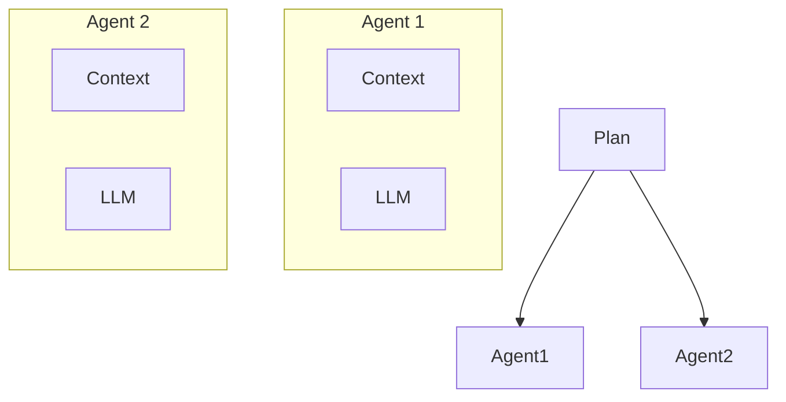

> **Nota: L'uso di Git Worktrees per la Parallelizzazione Multi-Agente**
> 
> Un'interessante analogia per l'isolamento del contesto degli agenti è l'uso dei `git worktrees`. Proprio come un sistema multi-agente richiede contesti separati (memoria, strumenti, stato), i worktree permettono di avere più branch dello stesso repository "check-outtati" in cartelle diverse, garantendo un completo isolamento a livello di filesystem.
> 
> **Come funziona?**
> *   **Isolamento di Codice e Stato**: Ogni agente può operare nel proprio worktree, con configurazioni, prompt e file di stato (es. log, database SQLite) completamente separati, eliminando i conflitti.
> *   **Sviluppo**: È un pattern potente per sviluppare e testare agenti diversi all'interno dello stesso progetto senza interferenze.
> 
> **Limiti da considerare:**
> *   **Non è un orchestratore di runtime**: I worktree gestiscono solo i file su disco, non l'esecuzione parallela dei processi. Per questo, sono necessari strumenti come script `bash`, `multiprocessing` di Python o, più comunemente, Docker.
> *   **Non gestisce la comunicazione**: I worktree isolano, quindi non offrono un meccanismo per la comunicazione tra agenti, che dovrebbe essere implementato separatamente (es. tramite API o una message queue).
> 
> In sintesi, i `git worktrees` sono un eccellente strumento per la **gestione dello sviluppo e della configurazione** di sistemi multi-agente, mentre strumenti come Docker sono più adatti per l'**orchestrazione in produzione**.

LangGraph supports multi-agent setups. A common approach is the **supervisor** architecture, also used in Anthropic multi-agent researcher. The supervisor delegates tasks to sub-agents, each running in its own context window.

Let's build a simple supervisor that manages two agents:

*   `math_expert` handles mathematical calculations.
*   `research_expert` searches and provides researched information.

The supervisor will decide which expert to call based on the query and coordinate their responses within the LangGraph workflow.

```python
from langgraph.prebuilt import create_react_agent
from langgraph_supervisor import create_supervisor

# --- Define Tools for Each Agent ---
def add(a: float, b: float) -> float:
    """Add two numbers."""
    return a + b

def multiply(a: float, b: float) -> float:
    """Multiply two numbers."""
    return a * b

def web_search(query: str) -> str:
    """Mock web search function that returns FAANG company headcounts."""
    return (
        "Here are the headcounts for each of the FAANG companies in 2024:\n"
        "1. **Facebook (Meta)**: 67,317 employees.\n"
        "2. **Apple**: 164,000 employees.\n"
        "3. **Amazon**: 1,551,000 employees.\n"
        "4. **Netflix**: 14,000 employees.\n"
        "5. **Google (Alphabet)**: 181,269 employees."
    )

# --- Create Specialized Agents with Isolated Contexts ---
math_agent = create_react_agent(
    model=llm,
    tools=[add, multiply],
    name="math_expert",
    prompt="You are a math expert. Always use one tool at a time."
)

research_agent = create_react_agent(
    model=llm,
    tools=[web_search],
    name="research_expert",
    prompt="You are a world class researcher with access to web search. Do not"
)

# --- Create Supervisor Workflow for Coordinating Agents ---
workflow = create_supervisor(
    [research_agent, math_agent],
    model=llm,
    prompt=(
        "You are a team supervisor managing a research expert and a math expert"
        "Delegate tasks to the appropriate agent to answer the user's query. "
        "For current events or facts, use research_agent. "
        "For math problems, use math_agent."
    )
)

# Compile the multi-agent application
app = workflow.compile()
```

Let's execute the workflow and see how the supervisor delegates tasks.

```python
# --- Execute the Multi-Agent Workflow ---
result = app.invoke({
    "messages": [
        {
            "role": "user",
            "content": "what's the combined headcount of the FAANG companies ir"
        }
    ]
})

# Format and display the results
format_messages(result['messages'])
```

Here, the supervisor correctly isolates the context for each task sending the research query to the researcher and the math problem to the mathematician showing effective context isolation.

You can learn more about:

*   **LangGraph Swarm** a Python library for building multi-agent systems with dynamic handoffs, memory, and human-in-the-loop support.
*   **Videos on multi-agent systems** additional insights into building collaborative AI agents (video 2, video 3).

## Isolation using Sandboxed Environments

HuggingFace's deep researcher shows a cool way to isolate context. Most agents use tool calling APIs that return JSON arguments to run tools like search APIs and get results.

HuggingFace uses a `CodeAgent` that writes code to call tools. This code runs in a secure **sandbox**, and results from running the code are sent back to the LLM.

This keeps heavy data (like images or audio) outside the LLM's token limit. HuggingFace explains:

> [Code Agents allow for] better handling of state ... Need to store this image/audio/other for later? Just save it as a variable in your state and use it later.

Using sandboxes with LangGraph is easy. The **LangChain Sandbox** runs untrusted Python code securely using Pyodide (Python compiled to WebAssembly). You can add this as a tool to any LangGraph agent.

**Note**: Deno is required. Install it here: [https://docs.deno.com/runtime/getting_started/installation/](https://docs.deno.com/runtime/getting_started/installation/)

```python
from langchain_sandbox import PyodideSandboxTool
from langgraph.prebuilt import create_react_agent

# Create a sandbox tool with network access for package installation
tool = PyodideSandboxTool(allow_net=True)

# Create a ReAct agent with the sandbox tool
agent = create_react_agent(llm, tools=[tool])

# Execute a mathematical query using the sandbox
result = await agent.ainvoke(
    {"messages": [{"role": "user", "content": "what's 5 + 7?"}]},
)

# Format and display the results
format_messages(result['messages'])
```

## State Isolation in LangGraph

An agent's **runtime state object** is another great way to isolate context, similar to sandboxing. You can design this state with a schema (like a Pydantic model) that has different fields for storing context.

For example, one field (like `messages`) is shown to the LLM each turn, while other fields keep information isolated until needed.

LangGraph is built around a **state** object, letting you create a custom state schema and access its fields throughout the agent's workflow.

For instance, you can store tool call results in specific fields, keeping them hidden from the LLM until necessary.

You've seen many examples of this in these notebooks.

## Summarizing Everything

Let's summarize, what we have done so far:

*   We used LangGraph `StateGraph` to create a "scratchpad" for short-term memory and an `InMemoryStore` for long-term memory, allowing our agent to store and recall information.
*   We demonstrated how to selectively pull relevant information from the agent's state and long-term memory. This included using Retrieval-Augmented Generation (RAG) to find specific knowledge and `langgraph-bigtool` to select the right tool from many options.
*   To manage long conversations and token-heavy tool outputs, we implemented summarization.
*   We showed how to compress RAG results on-the-fly to make the agent more efficient and reduce token usage.
*   We explored keeping contexts separate to avoid confusion by building a multi-agent system with a supervisor that delegates tasks to specialized sub-agents and by using sandboxed environments to run code.

All these techniques fall under “Contextual Engineering” a strategy to improve AI agents by carefully managing their working memory (context) to make them more efficient, accurate, and capable of handling complex, long-running tasks.

```